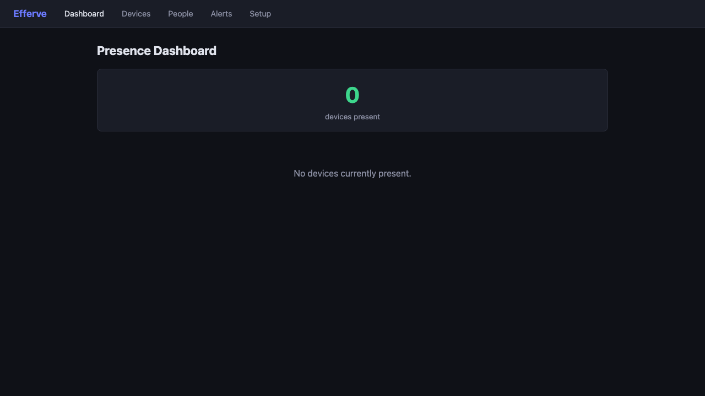
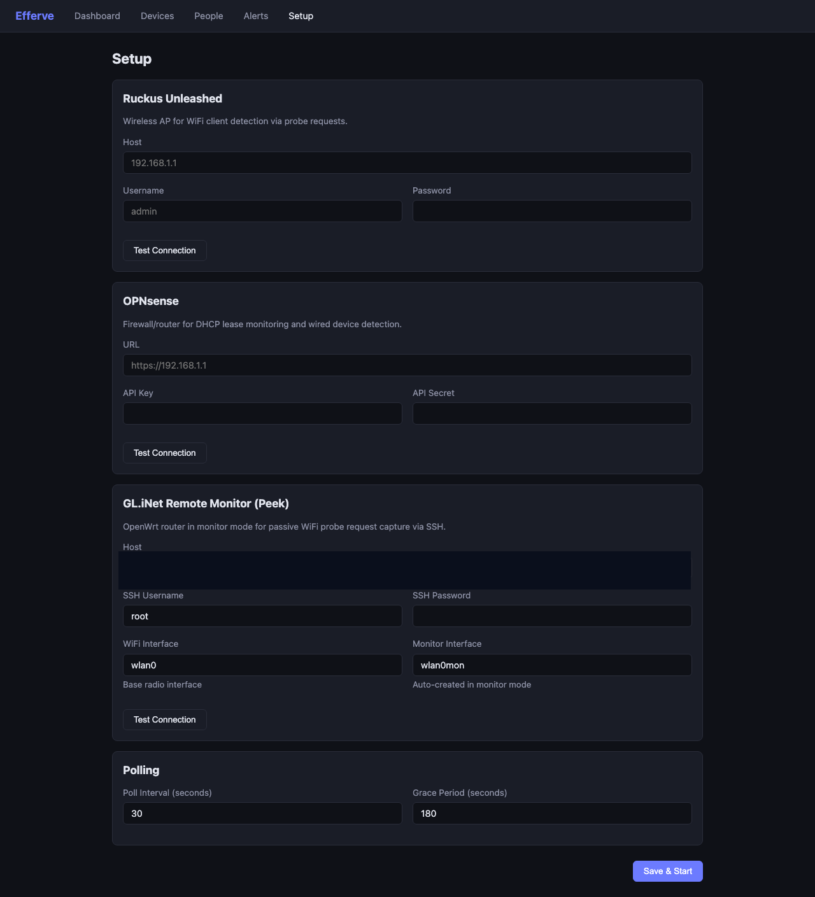
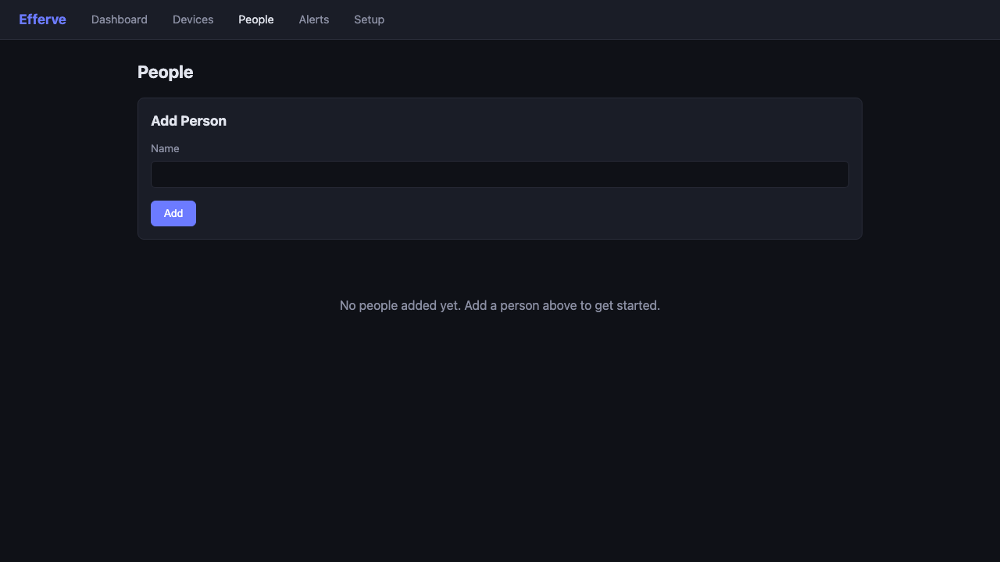
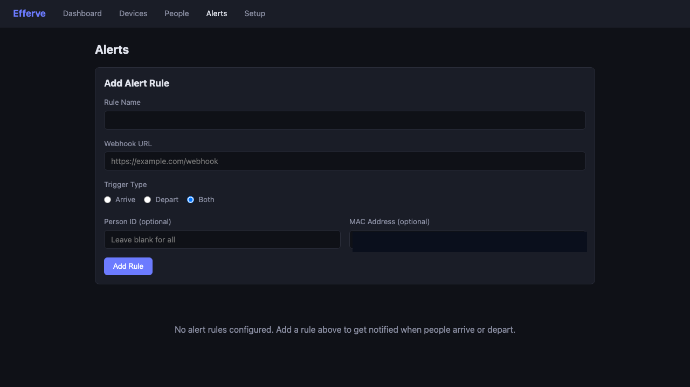

# Efferve

WiFi presence detection and home automation system.

## About

Efferve is a FastAPI service that ingests local network/WiFi observations, identifies household-relevant devices, associates devices with people, and triggers webhook automations on presence changes.

The system is built for home-lab and self-hosted environments where router/AP telemetry and monitor-mode packet observations can be combined into a single presence pipeline.

## Status

**Release maturity:** active development, functionally usable.

Implemented today:

- Multi-sniffer runtime with pluggable backends (Ruckus, OPNsense, GL.iNet, monitor mode, mock).
- Device registry with presence history and classification.
- Person-device association (persona layer).
- Alert rule evaluation + webhook dispatch.
- Setup wizard for connection tests and config save.
- Security hardening for webhook URL validation and request handling.
- `.env`-only configuration flow (`EFFERVE_*`).

## Core Capabilities

- Device observation ingestion from API polling and packet capture sources.
- Unified `BeaconEvent` processing pipeline.
- Household filtering (`resident`, `frequent visitor`, `passerby`).
- Presence-based automations via outbound webhooks.
- JSON API and server-rendered UI (Jinja2 + HTMX).

## Tech Stack

- Python 3.11+
- FastAPI
- SQLModel + SQLite (Postgres-ready design)
- Jinja2 + HTMX (no JS build system)
- Docker-first deployment

## Quick Start

```bash
cp .env.example .env
# edit .env with your environment/router settings
uv run pytest
uv run uvicorn efferve.main:app --reload
```

Open `http://localhost:8000`.

## Configuration and Secrets

- All runtime config is via environment variables (`EFFERVE_*`).
- Use `.env.example` as the template.
- Keep secrets in `.env` only; do not commit secret material.
- Security guidance: `SECURITY.md`.

## Quality Gates

```bash
uv run pytest
uv run ruff check src tests
```

## Architecture and Workflow Documentation

- Diagram index: `docs/diagrams/README.md`
- GitHub-friendly ASCII diagrams: `docs/diagrams/ASCII_DIAGRAMS.md`
- Editable Excalidraw sources:
  - `docs/diagrams/efferve-architecture.excalidraw`
  - `docs/diagrams/efferve-beacon-to-alert.excalidraw`
  - `docs/diagrams/efferve-use-cases.excalidraw`
  - `docs/diagrams/efferve-setup-workflow.excalidraw`
  - `docs/diagrams/efferve-classification.excalidraw`

## UI Screenshots

### Dashboard



### Setup



### People



### Alerts



## Repository Standards

- Security policy: `SECURITY.md`
- Contribution guide: `CONTRIBUTING.md`

## Roadmap

### Near-Term

- Improve persona confidence/association logic (multi-device identity scoring).
- Expand alert delivery capabilities and rule expressiveness.
- Add richer setup validation and diagnostics for sniffer backends.
- Harden deployment docs and operational runbooks.

### Medium-Term

- Add optional Postgres runtime path and migration guide.
- Add retention controls for presence history.
- Add stronger observability (structured logs + health/readiness checks).
- Introduce end-to-end integration test coverage for core presence workflows.

### Operational / Release Readiness

- Add semantic versioning + changelog/release notes process.
- Add CI gates for tests/lint/type checks on PRs.
- Add backup/restore guidance for runtime data.
